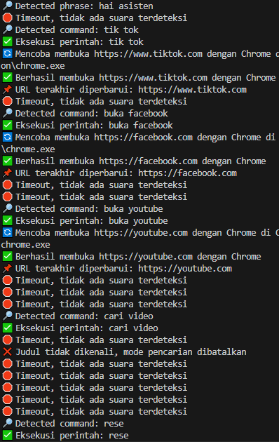
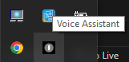

# Voice Assistant 🎤

A Python-based voice assistant that controls web browsers and media playback using voice commands. Currently features a functional system tray (GUI under development).



## Features ✨

- **Voice Activation**: Wake with "hai asisten", "hei asisten", or "hey assistant".
- **Browser Control**: Open YouTube, Spotify, Facebook, Google, TikTok, and YouTube Shorts.
- **Media Search**: Search songs on Spotify or videos on YouTube.
- **Tab Management**: Close tabs (e.g., "tutup youtube").
- **System Tray**: Minimize to tray with "Show GUI" and "Exit" options.
- **Commands**: Play, pause, scroll, and more (GUI pending).
- **Multilingual**: Supports Indonesian and English.

## Screenshots 📸

| **System Tray Menu**      |
|---------------------------|
|  |

## Getting Started 🛠️

### Prerequisites
Before you begin, ensure you have the following installed on your system:
- **Python**: Version 3.8 to 3.11 (download from [python.org](https://www.python.org/downloads/)).
- **Operating System**: Windows 10 or 11.
- **Microphone**: For voice input.
- **Google Chrome**: Recommended for browser control (optional, but preferred).

### Installation and Setup
Follow these steps to set up and run the Voice Assistant:

```bash
# Step 1: Clone the repository
git clone https://github.com/username/VoiceAssistantProject.git
cd VoiceAssistantProject

# Step 2: Verify Python installation
python --version

# Step 3: Install all dependencies in one go
pip install speechrecognition pyautogui pygetwindow pystray pillow

# Step 4: Run the assistant
python main.py

Notes
If "pip is not recognized", ensure Python is added to your system PATH or run:
python -m ensurepip --upgrade
python -m pip install --upgrade pip

- speechrecognition: Handles voice input.
- pyautogui: Automates browser interactions.
- pygetwindow: Manages windows.
- pystray: Enables system tray functionality.
- pillow: Processes images (e.g., tray icon).

Building an Executable (Optional)
To create a standalone .exe file, run the following commands:
# Step 1: Install PyInstaller
pip install pyinstaller

# Step 2: Build the executable
pyinstaller --onefile --noconsole --add-data "assistant_icon.ico;." --add-data "assistant_logo.png;." --icon=assistant_icon.ico main.py
- Output: main.exe will be generated in the dist/ folder (approximately 50 MB).
- Note: Ensure assistant_icon.ico and assistant_logo.png are in the project folder, or remove those flags if not used.

Usage 📖

1. Start the Assistant: Run main.py or main.exe.
2. Activate: Say "hai asisten" to enter command mode.
Example Commands:
"buka youtube" → Opens YouTube.
"cari lagu stairway to heaven" → Searches Spotify.
"cari video python tutorial" → Searches YouTube.
"tutup youtube" → Closes the YouTube tab.
"play" / "pause" → Controls video playback.
"berhenti" → Exits the program.
3. System Tray: Right-click the tray icon to show the menu (currently "Show GUI" is non-functional, "Exit" works).

Contributing 🤝
Fork this repository.
Create a new branch for your feature:
1. git checkout -b feature/your-feature

Commit your changes:
2. git commit -m "Add your feature"

Push to the branch:
3. git push origin feature/your-feature

Open a pull request.

License 📜
This project is licensed under the MIT License. See LICENSE for details.

Acknowledgments 🙏
SpeechRecognition for voice recognition.
PyAutoGUI for automation.
PyStray for system tray support.
Pillow for image processing.
Contact 📬
Have questions or suggestions? Open an issue or contact the community.
